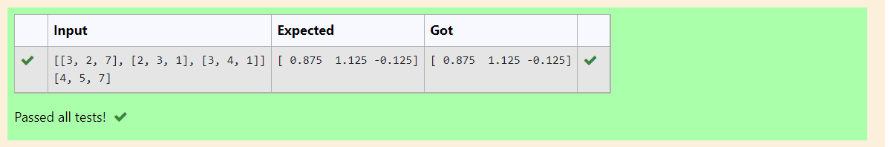

# LU Decomposition without zero on the diagonal

## AIM:
To write a program to find the LU Decomposition of a matrix.

## Equipments Required:
1. Hardware – PCs
2. Anaconda – Python 3.7 Installation / Moodle-Code Runner

## Algorithm
### Step1:
Import numpy and scipy.linalg
### Step2:
Take the input of the given matrix using eval
### Step3:
Calculate the values using the functions imported
### Step4:
print the required values.  

## Program:
### To print L and U matrix
~~~
Program to find the LU Decomposition of a matrix.
Developed by: Manoj Guna Sundar Tella
RegisterNumber: 21003796
import numpy as np
from scipy.linalg import lu
a=eval(input())
P,L,U = lu(a)
print(L)
print(U)
To print X matrix (solution to the equations)
~~~

### Program to solve the given matrix using LU Decompostion.
~~~ 
Developed by:  Manoj Guna Sundar Tella
RegisterNumber: 21003796
import numpy as np
from scipy.linalg import lu_factor,lu_solve
a = eval(input())
b = eval(input())
lu,piv = lu_factor(a)
x= lu_solve((lu,piv),b)
print(x)
~~~
## Output:
### Problem 1:

### Problem 2:

## Result:
Thus the program to find the LU Decomposition of a matrix is written and verified using python programming.

